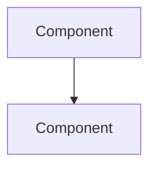

# Contributing

_Last reviewed: 2026-07-02 · Review cadence: quarterly_

This reference stays useful only if every page keeps the same shape. Before adding or editing, read this.

## Principles

1. **It's about *what to ask*, not how to build.** A TPM doesn't design the system — they ensure it's designed, reviewed, de-risked, and delivered. Keep content oriented toward inspection: questions, red flags, checklists. If a sentence reads like an engineering how-to, cut or reframe it.
2. **Layered, TL;DR first.** Every page opens with a TL;DR a reader can absorb in 60 seconds, then the detail below.
3. **Same skeleton every time.** Archetype cards follow the template below in the same order. Predictable structure is the whole point — once a reader learns one card, they can navigate all of them.
4. **Diagrams in Mermaid.** No image files. Mermaid renders natively on GitHub and stays diffable in version control.
5. **Cross-link, don't duplicate.** Cross-cutting concerns (security, reliability, cost, CI/CD) live in `cross-cutting/`. Link to them from archetype cards instead of repeating them.
6. **Concise and concrete.** Real service names and real patterns over generic filler. Tables earn their place; prose that rambles doesn't.
7. **Keep it fresh.** Every page has a `_Last reviewed_` date under its title. Bump it when you confirm a page still holds; log content changes in [CHANGELOG.md](CHANGELOG.md). Pages are reviewed **quarterly**. Ownership lives in [CODEOWNERS](https://github.com/selvankj/tpm-technical-reference/blob/main/CODEOWNERS) — stale authoritative-looking guidance is worse than none, so a page without a recent review date should be treated with suspicion.

## Adding a new archetype

1. Copy the template below into `archetypes/<your-archetype>.md`.
2. Fill every section in order. Don't drop sections — if one truly doesn't apply, say why in a line rather than deleting it.
3. Add a row to the archetype table in [`README.md`](README.md).
4. Add any "see also" cross-links at the bottom, and link back from related cards.

## Adding a cross-cutting playbook

Put it in `cross-cutting/`, keep the TL;DR-first format, and add a row to the cross-cutting table in the README. Cross-cutting pages are organized by concern (TL;DR → essentials table → detail → question bank), not by the archetype skeleton.

---

## Archetype card template

Copy everything below the line into a new file and fill it in.

---

````markdown
# Archetype: <Name>

_Last reviewed: YYYY-MM-DD · Review cadence: quarterly_

Overseeing <one-line description of the kind of project>.

> **TL;DR**
>
> - <The defining shape or decision in one line.>
> - <The TPM's core job for this archetype.>
> - Biggest red flags: <the 3–4 that matter most>.

---

## What it is

<2–4 sentences. What makes this project type distinct, and what's actually hard about it
from a delivery standpoint — not a textbook definition.>

---

## Reference architecture



---

## Components and what each does

| Component | Role | What "good" looks like / TPM note |
|-----------|------|-----------------------------------|
| <component> | <what it does> | <what good looks like, or why a TPM cares> |

<If the archetype has a single defining choice — sync vs async, tenancy model, the 6 Rs,
delivery guarantee — add a short subsection here that lays out the options and trade-offs.>

---

## Green flags

- <Signals the project is in good shape. 5–8 bullets.>

## Red flags / anti-patterns

- <Signals of trouble. 5–8 bullets. Be specific — name the failure, not "poor planning.">

---

## TPM question bank

- <The questions to take into a design/architecture review. 6–9 bullets, phrased as you'd
  actually ask them in the room.>

---

## Key risks

| Risk | How it shows up in the plan |
|------|-----------------------------|
| <risk> | <the observable signal in the backlog/plan/conversation> |

---

## Launch / readiness checklist

- [ ] <Archetype-specific readiness items. These layer ON TOP of the generic
      launch-readiness checklist in TPM-OPERATING-MODEL.md — don't repeat the generic ones.>

> See also: <links to sibling archetypes and relevant cross-cutting playbooks>

[← Back to index](../README.md)
````

---

## Style notes

- **Headings:** keep the section names verbatim so navigation stays consistent.
- **Tables:** use them for components, risks, and option comparisons. Keep cells short.
- **Tone:** direct and practitioner-to-practitioner. The reader is a busy TPM, not a student.
- **Length:** an archetype card is roughly 120–220 lines. If it's longer, you're probably explaining how to build something — trim back to what to inspect.
- **Links:** relative paths only (`../cross-cutting/...`, `../README.md`), so the repo is portable.

[← Back to index](README.md)
