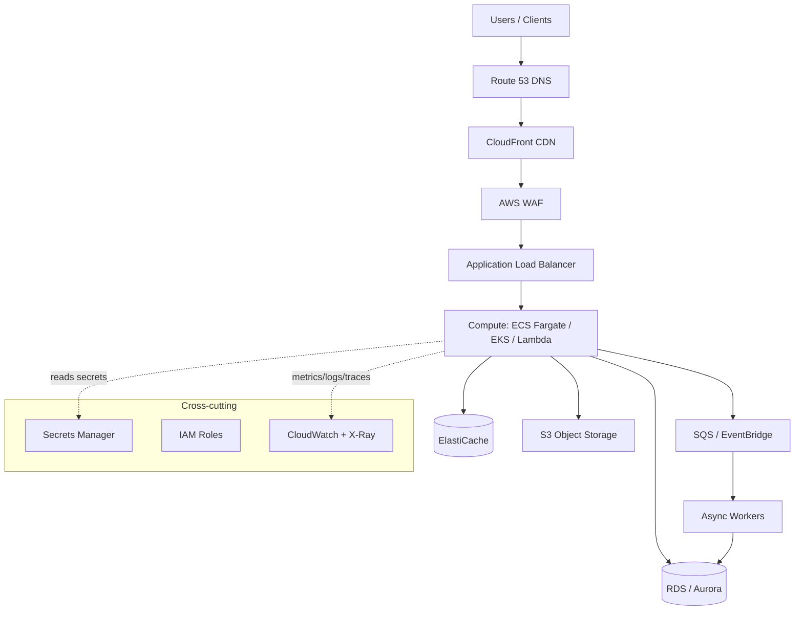

# Archetype: AWS Application

_Last reviewed: 2026-07-02 · Review cadence: quarterly_

Overseeing a web or API application hosted on AWS.

> **TL;DR**
>
> - Standard shape: **CDN + WAF → load balancer → containers/functions → managed database + cache + object storage**, with queues for async work.
> - The TPM's job is to confirm it's **multi-AZ**, that **IAM is least-privilege**, that there's **observability** before launch, and that someone has tested **rollback** and **restore**.
> - Biggest red flags: a single Availability Zone, long-lived access keys, no infrastructure-as-code, and "we'll add monitoring later."

---

## What it is

A request-serving application: users (or other systems) hit an endpoint, business logic runs, data is read/written, a response goes back. On AWS this is assembled from managed building blocks rather than servers you patch by hand.

---

## Scale tiers

| Tier | Typical shape | How it differs from the diagram |
|------|---------------|----------------------------------|
| **Small / early** | App Runner or a single Fargate service + one managed DB; or serverless (Lambda + API Gateway + DynamoDB) | Drop WAF / ElastiCache / SQS until needed; single-AZ can be acceptable for non-critical workloads |
| **Mid–large (the diagram)** | Full HA: CDN + WAF + ALB, Multi-AZ data, cache, async workers — single region | This is the default reference |
| **Hyperscale / global** | Multi-region, read replicas / sharding, global routing, aggressive caching, service decomposition | Add regions, data partitioning, global load balancing, tighter cost governance |

> The reference architecture below is the **mid-to-large, single-region, high-availability** tier. Match the build to the stage — over-engineering a small app wastes money and time; under-building a large one causes outages.

---

## Reference architecture

---

## Components and what each does

| Component | Role | What "good" uses |
|-----------|------|------------------|
| **Route 53** | DNS, health-checked routing | Aliased to CloudFront/ALB; failover records for DR |
| **CloudFront** | CDN, edge caching, TLS termination | Caches static assets; sits in front of the app |
| **WAF** | Filters malicious traffic | Managed rule sets + rate limiting |
| **ALB** | Distributes traffic across instances | Health checks; spreads across AZs |
| **Compute** | Runs the app | **Fargate/EKS** for services, **Lambda** for event/spiky workloads |
| **RDS / Aurora** | Managed relational DB | Multi-AZ; automated backups; read replicas if needed |
| **ElastiCache** | In-memory cache (Redis/Memcached) | Offloads DB; session/state store |
| **S3** | Object storage | Versioning + encryption + lifecycle rules |
| **SQS / EventBridge** | Decouples async work | Buffers spikes; enables retries + dead-letter queues |
| **Secrets Manager** | Stores credentials/keys | Rotation enabled; app reads at runtime, nothing in code |
| **IAM** | Who/what can do what | Roles per service, least privilege, no long-lived keys |
| **CloudWatch + X-Ray** | Logs, metrics, traces | Dashboards + alarms wired before launch |

---

## Green flags

- **Infrastructure as code** (Terraform / CDK / CloudFormation) — nothing clicked together by hand.
- **Multi-AZ** for anything stateful; the app survives one AZ going down.
- **IAM roles**, not access keys; permissions scoped tight.
- **Auto-scaling** configured with sane min/max and a tested scaling signal.
- Secrets in **Secrets Manager / Parameter Store**, never in env files in the repo.
- Dashboards, alarms, and **structured logs** exist *before* go-live.

## Red flags / anti-patterns

- **Single AZ**, or a database with no Multi-AZ / no tested backups.
- **Long-lived IAM access keys**, especially shared ones, or an over-broad `*` policy.
- "**ClickOps**" — infra built manually in the console, not reproducible.
- The app talks straight to the internet with **no WAF / no load balancer**.
- **No IaC, no CI/CD** — deploys are manual and scary.
- Monitoring is "we'll add it after launch."
- One giant role/account for everything (no environment or blast-radius separation).

---

## TPM question bank

- Is every stateful component **Multi-AZ**? What happens if one AZ fails right now?
- How is infrastructure defined — can we rebuild this environment from code?
- How does the app authenticate to AWS services — **roles or keys**? Where do secrets live?
- What auto-scales, on what signal, and what are the min/max bounds?
- Where's the dashboard? Show me the alarms and who they page.
- How do we deploy, and how do we **roll back**? When did we last test a rollback?
- When did we last **restore a backup** to prove it works?
- What's the cost shape — what are the top three line items? (See [FinOps](../cross-cutting/finops-cost.md).)

---

## Key risks

| Risk | How it shows up in the plan |
|------|-----------------------------|
| Single-AZ / no DR | "Multi-AZ" deferred to "later"; no restore test scheduled |
| IAM sprawl | No story for how permissions are scoped; broad policies "to unblock dev" |
| Manual infra | No IaC tickets; environments differ in undocumented ways |
| Cost surprise | NAT gateway, cross-AZ data transfer, and idle resources nobody owns |
| No observability | Monitoring tasks have no owner or sit at the bottom of the backlog |

---

## Launch checklist (AWS-specific)

- [ ] Multi-AZ confirmed for compute and data tiers
- [ ] IaC covers the whole stack; environment reproducible
- [ ] IAM reviewed — least privilege, no long-lived keys, secrets in Secrets Manager
- [ ] WAF rules enabled; TLS enforced end to end
- [ ] Auto-scaling tested under load
- [ ] CloudWatch dashboards + alarms live and routed to on-call
- [ ] Backups automated **and** a restore tested
- [ ] Rollback path tested
- [ ] Cost estimate reviewed; budget alarms set

> See also: [Security & compliance](../cross-cutting/security-and-compliance.md) · [Reliability & observability](../cross-cutting/reliability-and-observability.md) · [Azure equivalent](azure-application.md) · [Cloud service map](../reference/cloud-service-map.md)

[← Back to index](../README.md)
