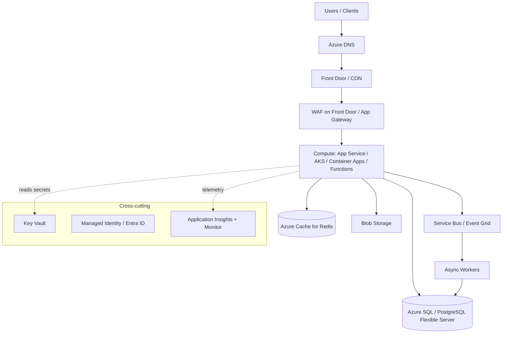

# Archetype: Azure Application

_Last reviewed: 2026-07-02 · Review cadence: quarterly_

Overseeing a web or API application hosted on Azure. Kept parallel to the [AWS card](aws-application.md) so the comparison is direct.

> **TL;DR**
>
> - Same shape as AWS: **CDN/Front Door + WAF → app platform → managed database + cache + blob storage**, with queues/Service Bus for async work.
> - Confirm it's **zone-redundant**, that identity runs through **Entra ID + Managed Identities** (not connection strings in config), that there's **observability via App Insights**, and that **rollback/restore** are tested.
> - Biggest red flags: single-zone, secrets in app settings instead of **Key Vault**, no Bicep/Terraform, and resource sprawl across ungoverned subscriptions.

---

## What it is

A request-serving application built from Azure's managed building blocks. The architecture mirrors AWS; the service names and the identity model differ.

---

## Scale tiers

| Tier | Typical shape | How it differs from the diagram |
|------|---------------|----------------------------------|
| **Small / early** | Container Apps or a single App Service + one managed DB; or serverless (Functions + API Management + Cosmos DB serverless) | Drop WAF / Redis / Service Bus until needed; single-zone can be acceptable for non-critical workloads |
| **Mid–large (the diagram)** | Full HA: Front Door + WAF, zone-redundant data, cache, async workers — single region | This is the default reference |
| **Hyperscale / global** | Multi-region with geo-replication, read scale-out / sharding, global Front Door routing, aggressive caching, service decomposition | Add regions, data partitioning, global routing, tighter cost governance |

> The reference architecture below is the **mid-to-large, single-region, high-availability** tier. Match the build to the stage — over-engineering a small app wastes money and time; under-building a large one causes outages.

---

## Reference architecture

---

## Components and what each does

| Component | Role | What "good" uses |
|-----------|------|------------------|
| **Azure DNS / Front Door** | DNS + global entry, edge caching, TLS | Front Door for global routing + WAF; CDN for static assets |
| **WAF** | Filters malicious traffic | Managed rules on Front Door or App Gateway |
| **App Service / AKS / Container Apps** | Runs the app | App Service for simple web/API; AKS/Container Apps for containers; **Functions** for event-driven |
| **Azure SQL / PostgreSQL** | Managed relational DB | Zone-redundant; automated backups; geo-replication for DR |
| **Cache for Redis** | In-memory cache | Offloads DB; session/state |
| **Blob Storage** | Object storage | Versioning + encryption + lifecycle tiers |
| **Service Bus / Event Grid** | Async messaging / events | Buffers spikes; dead-letter queues; pub/sub |
| **Key Vault** | Secrets, keys, certs | App reads via Managed Identity; rotation enabled |
| **Entra ID + Managed Identity** | Identity for users and services | App authenticates to Azure with **no stored credentials** |
| **App Insights + Monitor** | Logs, metrics, traces | Dashboards + alerts wired before launch |

---

## Green flags

- **Infrastructure as code** (Bicep / Terraform / ARM) — reproducible, not click-built.
- **Zone-redundant** config for stateful tiers; survives a zone outage.
- **Managed Identity** everywhere; the app holds no connection strings or keys.
- Secrets in **Key Vault**, referenced at runtime — not in App Service application settings or the repo.
- Clear **subscription / resource-group / management-group** structure with policy guardrails (Azure Policy).
- **Application Insights** dashboards and alerts live before go-live.

## Red flags / anti-patterns

- **Single zone**, or a database with no zone redundancy / no tested backups.
- **Connection strings and keys** living in app settings or, worse, in source control.
- No **Managed Identity** — service principals with static secrets passed around.
- **ClickOps** — built by hand in the portal, no IaC.
- Resources scattered across **ungoverned subscriptions** with no naming/tagging/policy.
- Monitoring deferred until after launch.

---

## TPM question bank

- Is every stateful component **zone-redundant**? What happens if a zone fails now?
- How is infrastructure defined — **Bicep/Terraform** — and can we rebuild from it?
- Does the app use **Managed Identity**, or are there stored secrets/connection strings? Where does Key Vault fit?
- How are subscriptions and resource groups organized? Is **Azure Policy** enforcing guardrails?
- Show me the **Application Insights** dashboard and the alert rules. Who do they notify?
- How do we deploy and **roll back**? When was rollback last tested?
- When did we last **restore a backup**?
- What are the top three cost line items? (See [FinOps](../cross-cutting/finops-cost.md).)

---

## Key risks

| Risk | How it shows up in the plan |
|------|-----------------------------|
| Single-zone / no DR | Zone redundancy and geo-replication deferred; no restore test |
| Secret sprawl | Connection strings in app settings; no Key Vault story |
| Ungoverned subscriptions | No tagging/naming/policy; cost and ownership unclear |
| Manual infra | No Bicep/Terraform; environments drift |
| No observability | App Insights setup unowned or backlogged |

---

## Launch checklist (Azure-specific)

- [ ] Zone redundancy confirmed for compute and data tiers
- [ ] IaC (Bicep/Terraform) covers the whole stack
- [ ] Identity via **Managed Identity**; secrets in **Key Vault**, none in config/repo
- [ ] WAF enabled on Front Door / App Gateway; TLS enforced
- [ ] Auto-scaling tested under load
- [ ] App Insights dashboards + alerts live and routed to on-call
- [ ] Backups automated **and** restore tested; geo-replication for DR if required
- [ ] Rollback (deployment slots / revisions) tested
- [ ] Cost estimate reviewed; budget alerts set; tagging in place

> See also: [Security & compliance](../cross-cutting/security-and-compliance.md) · [Reliability & observability](../cross-cutting/reliability-and-observability.md) · [AWS equivalent](aws-application.md) · [Cloud service map](../reference/cloud-service-map.md)

[← Back to index](../README.md)
