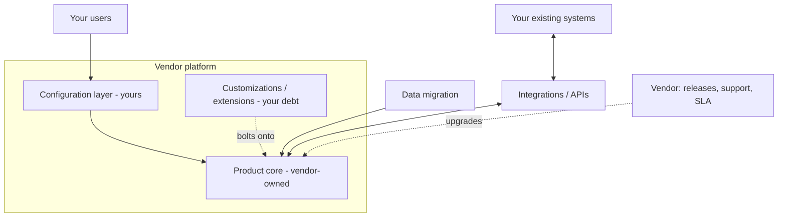

# Archetype: COTS / Vendor-Platform Implementation

_Last reviewed: 2026-07-02 · Review cadence: quarterly_

Overseeing a project where the "system" is a **vendor product you configure**, not software you build — a commercial off-the-shelf (COTS) or SaaS platform being implemented, configured, and integrated (e.g. an eClinical suite, a CRM-based platform, an ERP, an ITSM tool).

> **TL;DR**
>
> - The risk profile flips: you're not managing *what gets built*, you're managing **configuration vs. customization, vendor dependency, and fit-to-process**. The vendor owns the code; you own the fit, the data, and the integration.
> - The single most important discipline: **stay on the configuration side of the line.** Every customization you add is upgrade debt you'll pay forever.
> - The TPM's job: pin down **requirements-to-fit** honestly (does the product actually do this, or are we bending it?), own the **integration and data-migration** work (which is where these projects actually run late), and manage the **vendor as a dependency** with SLAs and escalation.
> - Biggest red flags: heavy customization to force-fit a process, treating the vendor demo as reality, no ownership of integration/migration, and no plan for vendor upgrades or lock-in.

---

## What it is

A project delivered mostly through **configuration, integration, data migration, and change management** rather than engineering. The product exists; the work is making it fit your processes, connecting it to your other systems, moving your data in, and getting people to adopt it. Build-heavy instincts mislead here — the hard parts are fit, integration, and organizational change, not code.

---

## Scale note

> A **single-department rollout** is mostly configuration + training. **Enterprise-wide** (multi-geo, multi-entity) adds data-residency, localization, complex integration landscapes, phased regional rollouts, and heavier change management — and magnifies the cost of every customization you took on.

---

## Reference architecture

---

## The decision that defines the project: configuration vs. customization

| | Configuration | Customization |
|---|---------------|---------------|
| **What** | Settings, workflows, fields the product is *designed* to let you change | Code/extensions beyond what the product supports out of the box |
| **Upgrade impact** | Survives vendor upgrades | Can break on every upgrade — you re-test and re-fix forever |
| **Cost over time** | Low | Compounding — this is the debt that sinks COTS programs |
| **Rule of thumb** | Prefer it, always | Only when the business value is undeniable and there's no config path |

> **The 80/20 fit test.** If the product fits ~80% of your needs through configuration, adapt your *process* for most of the rest and customize only the genuinely differentiating 20%. If you're customizing heavily to force-fit, you either picked the wrong product or you're rebuilding it badly on someone else's platform. Either way, stop and re-decide.

---

## Where these projects actually run late

Teams underestimate everything *except* the product itself:

- **Data migration** — cleaning, mapping, and moving legacy data is almost always harder and longer than planned. (See [migration](migration-modernization.md) for the reconciliation discipline.)
- **Integration** — wiring the platform to your existing systems. (See [integration](integration-api.md).)
- **Change management & training** — adoption fails not on technology but on people. A perfectly configured system nobody uses is a failed project.
- **Vendor lead times** — support tickets, feature gaps that need a vendor roadmap commitment, and their release schedule are all outside your control.

---

## Green flags

- **Honest fit analysis** — a real requirements-to-product mapping showing what's configuration, what needs customization, and what the process should absorb.
- **Configuration-first discipline** — customization is the exception, justified case by case, and tracked as upgrade debt.
- **Integration and data migration are owned and resourced** as first-class workstreams, not assumed to be trivial.
- **Vendor managed as a dependency** — contracted SLAs, named escalation path, clarity on their release/upgrade cadence.
- **Change management and training** are in the plan from the start.
- Clear **shared-responsibility model** — what the vendor secures/operates vs. what you do (the SaaS security-model question).
- **Exit / portability thinking** — you know how to get your data out if you leave.

## Red flags / anti-patterns

- **Heavy customization** to force the product to match an existing process exactly — the classic COTS money pit and upgrade nightmare.
- **The demo is treated as reality** — the polished sales demo hides configuration effort, gaps, and edge cases.
- **Integration and migration under-scoped** — "we'll just import the data" with no cleaning/mapping/reconciliation plan.
- **No adoption plan** — go-live is treated as the finish line; users quietly keep using the old way.
- **Vendor lock-in ignored** — no exit strategy, no data-portability check, pricing leverage entirely on their side.
- **Validation skipped** on vendor releases in a regulated context — see below.
- No clarity on **who owns what** in the shared-responsibility model.

---

## TPM question bank

- What's our honest **fit percentage** through configuration alone? Where are we customizing, and why can't config or a process change handle it?
- Are we staying **configuration-first**? Is every customization justified and tracked as upgrade debt?
- Who owns **integration** and **data migration**, and are they resourced as real workstreams? What's the reconciliation plan?
- Did we scope from the product's *actual* behavior or from the **demo**?
- How is the **vendor** managed — SLA, escalation, roadmap dependencies, release cadence?
- What's the **change-management and training** plan? How do we know people will adopt it?
- In a regulated context: how do we **validate vendor upgrades**, and does the vendor support that (validation docs, GxP posture)?
- What's the **shared-responsibility model**, and what's our **exit / data-portability** story?

---

## Key risks

| Risk | How it shows up in the plan |
|------|-----------------------------|
| Customization debt | Long list of "must-have" custom features to match old process |
| Demo-driven scope | Requirements written from the sales demo, not a real fit analysis |
| Migration blowout | "Import the data" as a single line item, no cleaning/reconciliation |
| Integration surprise | Interfaces to existing systems assumed simple, unowned |
| Adoption failure | No change-management/training workstream; go-live = done |
| Vendor lock-in | No exit plan; no data-portability check |
| Upgrade breakage | Customizations re-break each release; regulated validation not planned |

---

## Launch / readiness checklist

- [ ] Fit analysis done; configuration-vs-customization line drawn and justified
- [ ] Customizations minimized and logged as upgrade debt
- [ ] Data migrated **and reconciled** (see [migration](migration-modernization.md))
- [ ] Integrations built and tested (see [integration](integration-api.md))
- [ ] Change management + training delivered; adoption measured post-launch
- [ ] Vendor SLA, support, and escalation path in place
- [ ] Regulated: vendor-release validation approach agreed; validation evidence captured
- [ ] Shared-responsibility model documented (vendor vs. you)
- [ ] Exit / data-portability path understood

> See also: [Migration / modernization](migration-modernization.md) · [Integration / API](integration-api.md) · [SaaS multi-tenant](saas-multitenant.md) (the vendor *is* a multi-tenant SaaS) · [Security & compliance](../cross-cutting/security-and-compliance.md)

[← Back to index](../README.md)
