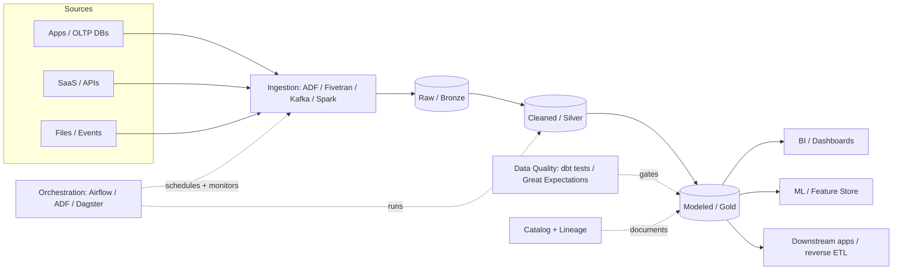

# Archetype: Data Engineering

_Last reviewed: 2026-07-02 · Review cadence: quarterly_

Overseeing a pipeline that moves data from source systems through storage and transformation to consumption (BI, ML, downstream apps).

> **TL;DR**
>
> - The flow is always: **ingest → land (raw) → transform (cleaned → modeled) → serve**, with **orchestration** running it and **data quality** gating it.
> - The TPM's job: confirm there's a **layered/medallion structure**, that pipelines are **idempotent and re-runnable**, that **data quality checks** exist (not just "the job ran"), and that **lineage and ownership** are clear.
> - Biggest red flags: "the job succeeded" treated as "the data is correct," no schema-change handling, no backfill story, and one heroic person who understands the DAG.

---

## What it is

A system whose *output is trustworthy data*, not a user-facing response. Success isn't "the pipeline ran" — it's "the numbers are right, on time, and someone can trace where they came from."

---

## Scale note

> The lakehouse shape here suits **mid-size batch analytics** — a handful to dozens of sources, GB-to-low-TB volumes, scheduled runs. **Smaller:** a managed ELT tool (Fivetran/Airbyte) + a warehouse + dbt, no Spark. **Larger / real-time:** add streaming (see [event-driven](event-driven-streaming.md)), partitioning, and a proper serving/feature layer; PB-scale forces deliberate file-format, partitioning, and cluster-sizing decisions.

---

## Reference architecture

---

## Components and what each does

| Layer | Role | Common tools |
|-------|------|--------------|
| **Ingestion** | Pull/stream data from sources | ADF, Fivetran/Airbyte, Kafka, Spark, custom |
| **Raw / Bronze** | Land source data as-is, immutable | S3/ADLS/GCS, Delta/Iceberg/Parquet |
| **Cleaned / Silver** | Deduped, typed, conformed | dbt, Spark/Databricks |
| **Modeled / Gold** | Business-ready facts & dimensions | dbt, warehouse (Snowflake/BigQuery/Synapse/Redshift) |
| **Serving** | Where consumers read | BI tools, feature store, reverse ETL |
| **Orchestration** | Schedules, sequences, retries, alerts | **Airflow**, ADF, Dagster, Prefect |
| **Data quality** | Tests data, not just job status | **dbt tests**, Great Expectations, Soda |
| **Catalog + lineage** | What exists, where it came from, who owns it | Unity Catalog, DataHub, Purview, OpenMetadata |

> The **medallion** (bronze/silver/gold) pattern is the common shape, but the principle is what matters: **raw is preserved, transformations are layered and re-runnable, and the business-ready layer is governed.**

---

## Green flags

- **Idempotent, re-runnable** pipelines — re-running doesn't double-count or corrupt.
- **Backfill** is a designed capability, not a panic operation.
- **Data quality tests** gate promotion to the served layer (row counts, nulls, uniqueness, referential integrity, freshness).
- **Schema-change handling** is explicit — a source adds a column and the pipeline doesn't silently break or drop data.
- **Lineage** is visible end to end; every served table has an **owner**.
- Orchestration has **retries, alerting, and SLAs** per pipeline.
- Raw layer is **immutable** — you can always reprocess from source-of-truth.

## Red flags / anti-patterns

- "**The job succeeded**" is the only health signal — no check that the *data* is correct.
- No **idempotency**: a re-run double-loads or breaks.
- **No backfill plan**; fixing historical data is improvised.
- Transformations are a pile of hand-written SQL with **no tests and no lineage**.
- **Schema drift** silently corrupts downstream tables.
- One person understands the whole DAG (**bus factor of 1**).
- Reconciliation against source-of-truth is **never done** — nobody can prove the numbers.

---

## TPM question bank

- Walk me through the layers — where does **raw** land, and is it immutable?
- Are pipelines **idempotent**? What happens if we re-run yesterday's load?
- How do we **backfill** six months of corrected history? Has that been done?
- What **data-quality checks** run, and what do they *block* when they fail? (Not just alert — block.)
- What happens when a source system **adds or renames a column**?
- Can you show me **lineage** for this dashboard's key metric back to source?
- Who **owns** each served dataset? Who gets paged when freshness breaks?
- What's the **SLA** on each pipeline — how late is "too late"?
- How do we **reconcile** the warehouse against source-of-truth?

---

## Key risks

| Risk | How it shows up in the plan |
|------|-----------------------------|
| Silent data corruption | No DQ tests; "job green" treated as "data correct" |
| Non-idempotent pipelines | No re-run/backfill design; incidents resolved by manual surgery |
| Schema drift | No contract or detection for source changes |
| Bus factor | One name on every pipeline; no runbooks; no catalog |
| Cost blowout | Full-table scans, no partitioning, oversized warehouses left running |
| Untraceable numbers | No lineage; reconciliation never scheduled |

---

## Launch / readiness checklist

- [ ] Layered architecture (raw preserved, transforms re-runnable, served layer governed)
- [ ] Pipelines idempotent; backfill tested
- [ ] Data-quality tests in place and **gating** promotion
- [ ] Schema-change handling defined
- [ ] Lineage visible; every served dataset has a named owner
- [ ] Orchestration alerting + per-pipeline SLAs configured
- [ ] Reconciliation against source-of-truth scheduled
- [ ] Cost reviewed (partitioning, warehouse sizing, auto-suspend)
- [ ] Sensitive data classified and access-controlled (see [security & compliance](../cross-cutting/security-and-compliance.md))

> See also: [GenAI / LLM](genai-llm.md) and [ML model](ml-model.md) often sit downstream of this · [Reliability & observability](../cross-cutting/reliability-and-observability.md)

[← Back to index](../README.md)
