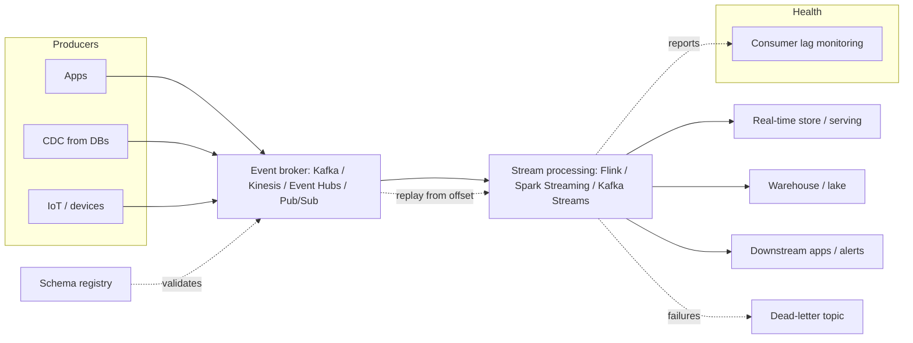

# Archetype: Event-Driven / Streaming

_Last reviewed: 2026-07-02 · Review cadence: quarterly_

Overseeing a system built around a continuous flow of events — real-time pipelines, event sourcing, stream processing (clickstreams, IoT, transactions, change-data-capture).

> **TL;DR**
>
> - Different from [point-to-point integration](integration-api.md): this is **high-throughput, continuous streams** processed in motion, not occasional request/response between two systems.
> - The decisions that define it: **delivery guarantee** (at-least-once vs. exactly-once), **ordering** (and the partitioning that enables it), and **how you handle replay and late/out-of-order events**.
> - The TPM's job: confirm there's a **schema registry/contract**, that **consumer lag** is monitored, that **poison messages** can't stall a stream, and that the team can **replay** from a point in time.
> - Biggest red flags: assuming exactly-once for free, no schema governance, no consumer-lag monitoring, and no replay/reprocessing story.

---

## What it is

A backbone where producers emit events and many consumers react, decoupled in time. The hard parts are the **guarantees**: did every event get processed, exactly once, in the right order — and can you recover when a consumer falls behind or a bad event appears?

---

## Scale note

> Throughput sets the design. **Thousands of events/sec** is comfortable for most managed brokers on default settings. **Millions/sec** forces deliberate partitioning, consumer parallelism, retention/cost trade-offs, and careful backpressure — and makes the exactly-once and ordering choices far more consequential.

---

## Reference architecture

---

## Components and what each does

| Component | Role | Common tools |
|-----------|------|--------------|
| **Event broker / log** | Durable, ordered, replayable stream of events | Kafka, Kinesis, Event Hubs, Pub/Sub |
| **Schema registry** | Enforces a versioned contract on event shape | Confluent Schema Registry, Avro/Protobuf schemas |
| **Stream processor** | Transforms/aggregates/joins events in motion | Flink, Spark Structured Streaming, Kafka Streams |
| **Partitions** | Unit of parallelism + ordering guarantee | Ordering is per-partition, not global |
| **Consumer groups / offsets** | Track how far each consumer has read | Enables replay and parallel consumption |
| **Dead-letter topic** | Where unprocessable events go | Stops a poison message from blocking the stream |
| **Sinks** | Where processed results land | Real-time stores, warehouse, downstream services |

---

## The decisions that define the system

**Delivery guarantee**
- **At-least-once** — every event processed, but duplicates possible. Common default. *Requires idempotent consumers.*
- **Exactly-once** — no loss, no duplicates. Achievable but costs throughput/complexity and only end-to-end if every hop supports it. Don't assume it's free.
- **At-most-once** — no duplicates, but events can be lost. Rarely what you want.

**Ordering** — guaranteed only **within a partition**, not across the whole stream. The **partition key** determines what's ordered together (e.g. key by `customer_id` so a customer's events stay ordered). Getting the key wrong breaks ordering invariants downstream.

**Time & lateness** — events arrive late and out of order. Processing needs a strategy: event-time vs. processing-time, **watermarks**, and windowing. "We'll just use arrival time" silently corrupts time-based aggregations.

---

## Green flags

- A **schema registry / versioned event contract** — producers can't ship a breaking shape that blows up consumers.
- **Idempotent consumers** (for at-least-once) so duplicates don't double-count.
- **Consumer-lag monitoring** — you can see when a consumer falls behind before it becomes an incident.
- A **dead-letter topic** + process, so one bad event doesn't stall the whole stream.
- **Replay** is a designed capability — reprocess from an offset/timestamp after a bug fix.
- **Partition key chosen deliberately** to preserve the ordering guarantees the business needs.
- Explicit handling of **late / out-of-order** events (watermarks, windows).

## Red flags / anti-patterns

- Assuming **exactly-once** "just happens" — it doesn't, and the gap shows up as duplicate or lost data.
- **No schema governance** — a producer changes the event shape and consumers break.
- **No consumer-lag monitoring** — the first sign of trouble is stale downstream data or customer complaints.
- **Poison message stalls the stream** — no dead-letter handling, so one bad event blocks everything behind it.
- **No replay** — after a bug, there's no way to reprocess affected events.
- **Wrong/absent partition key** — ordering assumptions silently violated.
- Treating event time as arrival time — time-windowed results quietly wrong.

---

## TPM question bank

- What's the **delivery guarantee** — at-least-once or exactly-once — and are consumers **idempotent** accordingly?
- Is there a **schema registry**? What happens when a producer changes an event's shape?
- How is **ordering** guaranteed, and what's the **partition key**? Does it match the business invariant?
- Do we **monitor consumer lag**? What's the alert when a consumer falls behind?
- What happens to an event we **can't process** — is there a dead-letter topic and a way to handle it?
- Can we **replay** from a point in time after fixing a bug? Has that been done?
- How do we handle **late / out-of-order** events?
- What's the **throughput** ceiling, and what happens at a spike beyond it?

---

## Key risks

| Risk | How it shows up in the plan |
|------|-----------------------------|
| Duplicate / lost data | "Exactly-once" assumed; consumers not idempotent |
| Schema break | No registry; informal event shapes |
| Silent backlog | No consumer-lag monitoring |
| Stream stall | No dead-letter handling; poison message blocks partition |
| Can't recover | No replay/reprocessing capability |
| Broken ordering | Partition key wrong or undefined |
| Wrong aggregations | Event-time/lateness not handled |

---

## Launch / readiness checklist

- [ ] Delivery guarantee chosen; consumers idempotent if at-least-once
- [ ] Schema registry / versioned event contract enforced
- [ ] Partition key chosen to preserve required ordering
- [ ] Consumer-lag monitoring + alerting live
- [ ] Dead-letter topic + a process to drain it
- [ ] Replay/reprocessing tested
- [ ] Late / out-of-order event strategy defined (watermarks/windows)
- [ ] Throughput tested at peak + headroom; backpressure behavior known
- [ ] Retention configured (how long events stay replayable)

> See also: [Integration / API](integration-api.md) (point-to-point sibling) · [Data engineering](data-engineering.md) (streams often feed the lakehouse) · [Reliability & observability](../cross-cutting/reliability-and-observability.md)

[← Back to index](../README.md)
