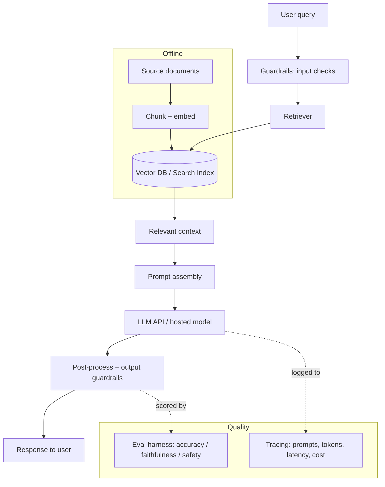

# Archetype: GenAI / LLM Application

_Last reviewed: 2026-07-02 · Review cadence: quarterly_

Overseeing a product feature backed by a large language model — RAG (retrieval-augmented generation), agents, summarization, extraction, or chat.

> **TL;DR**
>
> - Most GenAI apps are **RAG**: retrieve relevant context, stuff it into a prompt, call a model, post-process. The model is rarely the hard part — **retrieval quality, evaluation, and guardrails** are.
> - The TPM's job: insist on an **evaluation harness** (you cannot ship what you can't measure), confirm **guardrails** for safety/PII/prompt-injection, watch **cost and latency per request**, and define what **"good enough" accuracy** means *before* build.
> - Biggest red flags: no eval set, "it looked good in the demo" as the quality bar, no plan for hallucination/wrong answers, and sensitive data flowing to a model with no review.

---

## What it is

A feature that uses a generative model to produce text/structured output. The non-determinism changes how you manage it: there's no single "correct" output to test against, so **quality is a distribution you measure**, not a checkbox.

---

## Scale note

> The RAG shape fits a **single production feature**. **Prototype:** a hosted model + a simple vector store is enough to start (but don't skip the eval set). **At scale** (high QPS, many features): add caching, rate limiting, prompt/version governance, an automated evaluation pipeline, and revisit hosted-vs-self-hosted on cost and latency.

---

## Reference architecture (RAG)

---

## Components and what each does

| Component | Role | Notes for the TPM |
|-----------|------|-------------------|
| **Embedding + chunking** | Turn documents into searchable vectors | Chunking strategy heavily affects answer quality |
| **Vector DB / search index** | Find relevant context for a query | Retrieval quality is usually the bottleneck, not the model |
| **Retriever** | Pull the right context | Often hybrid (keyword + vector) + re-ranking |
| **Prompt assembly** | Combine query + context + instructions | Versioned and reviewable, not buried in code |
| **LLM** | Generate the output | API (OpenAI/Anthropic/etc.) or self-hosted; trade-off cost/latency/control |
| **Guardrails** | Block bad input/output | PII filtering, prompt-injection defense, safety, grounding checks |
| **Eval harness** | Measure quality on a fixed set | The single most important thing to demand |
| **Observability** | Trace prompts, tokens, latency, cost | Per-request, because cost scales with usage |

---

## Green flags

- A **golden eval set** of representative inputs with expected/acceptable outputs, run automatically on every change.
- Quality measured on real axes: **accuracy, faithfulness/groundedness, safety, refusal behavior** — not vibes.
- **Guardrails** for prompt injection, PII leakage, and off-topic/unsafe output.
- **Prompts are versioned**; changes are reviewed like code.
- **Cost and latency per request** are tracked and budgeted.
- A defined **fallback** for low-confidence/failed answers (escalate to human, "I don't know," etc.).
- Clear stance on **data handling** — what gets sent to the model, retention, and whether a vendor can train on it.

## Red flags / anti-patterns

- **No eval set.** Quality is "it looked good when I tried it."
- No plan for **hallucination** / confidently-wrong answers in a context where wrong is harmful.
- **Sensitive/regulated data** sent to a third-party model with no review of terms or PII handling.
- **Prompt injection** not considered (user input can override system instructions).
- Cost is unmodeled — a viral week produces a shock bill.
- Prompts edited live in production with no versioning or rollback.
- Treating the LLM as deterministic ("it'll always return JSON") with no validation.

---

## TPM question bank

- What's our **eval set**, and what metrics do we track on it? Show me the last run.
- What does **"good enough" accuracy** mean here, and who agreed to it?
- What's the **cost and latency per request**, and what's the projected monthly bill at expected volume?
- What data leaves our boundary to reach the model? Can the vendor **train on it**? (Critical for regulated/healthcare data.)
- How do we handle a **wrong or hallucinated** answer? What's the fallback?
- Are we defended against **prompt injection** and PII leakage?
- How are **prompts versioned** and changes reviewed?
- If retrieval returns junk, does the system know — or does it answer confidently anyway?

---

## Key risks

| Risk | How it shows up in the plan |
|------|-----------------------------|
| No measurable quality | No eval harness; demo-driven sign-off |
| Harmful wrong answers | No accuracy bar, no fallback for low confidence |
| Data leakage / compliance | No review of what's sent to the model or vendor terms |
| Cost runaway | Per-request cost unmodeled; no rate limiting/caching |
| Prompt injection | User input can override instructions; not tested |
| Retrieval quality | All effort on the model, none on chunking/retrieval/re-ranking |

---

## Launch / readiness checklist

- [ ] Golden eval set exists; metrics defined and passing the agreed bar
- [ ] Accuracy/quality threshold agreed with stakeholders *in writing*
- [ ] Guardrails: input/output filtering, PII, prompt-injection, safety
- [ ] Data-handling reviewed (what's sent, retention, training rights) — esp. for regulated data
- [ ] Cost per request modeled; rate limits / caching in place; budget alerts set
- [ ] Latency acceptable at expected load
- [ ] Fallback path for low-confidence / failed responses
- [ ] Prompt versioning + rollback
- [ ] Tracing/observability on tokens, cost, latency, and quality in production

> See also: [Data engineering](data-engineering.md) (RAG sits on a data pipeline) · [ML model](ml-model.md) · [Security & compliance](../cross-cutting/security-and-compliance.md)

[← Back to index](../README.md)
