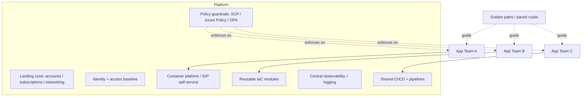

# Archetype: Infrastructure / Platform

_Last reviewed: 2026-07-02 · Review cadence: quarterly_

Overseeing foundational infrastructure or an internal platform whose **customers are other engineering teams** — landing zones, shared services, a Kubernetes platform, or an internal developer platform (IDP).

> **TL;DR**
>
> - The product is **leverage**: the platform exists so application teams ship faster and more safely. Success is measured by **adoption and developer experience**, not by the platform existing.
> - The key tension is **self-service + guardrails**: teams should move fast *within* safe, paved paths — not file tickets for everything, and not freely do anything.
> - The TPM's job: confirm there are **golden paths**, **policy guardrails** (not just docs), a **funded ownership/run model**, and that the platform itself has **SLOs** — because if it goes down, *everyone* is down.
> - Biggest red flags: a platform nobody adopts, "guardrails" that are just a wiki page, a ticket-driven bottleneck team, and no one owning the platform's own reliability.

---

## What it is

Shared foundations that many teams build on: account/network structure, identity, CI/CD, observability tooling, a container platform, reusable IaC modules. Its blast radius is the whole org, and its hardest problem is **organizational, not technical** — getting teams to adopt the paved path instead of rolling their own.

---

## Scale note

> For a **single team or a handful**, "platform" can be a few shared modules and a paved CI/CD path. **Org-wide**, it becomes a product with its own team, SLOs, versioned modules, policy-as-code, and an adoption strategy. The governance and support model is what scales, not just the tech.

---

## Reference architecture

---

## Components and what each does

| Component | Role | What "good" looks like |
|-----------|------|------------------------|
| **Landing zone** | Account/subscription structure, networking, baseline security | Reproducible via IaC; environments and blast-radius separated |
| **Identity baseline** | SSO, roles, access patterns teams inherit | Least privilege by default; teams don't reinvent auth |
| **Policy guardrails** | Automated rules teams can't violate | Enforced (SCPs, Azure Policy, OPA/Gatekeeper) — not a wiki |
| **Reusable IaC modules** | Vetted building blocks | Versioned, documented, with sensible secure defaults |
| **Shared CI/CD** | Pipelines teams adopt rather than build | Paved path that's easier than DIY |
| **Central observability** | Logging/metrics/tracing teams plug into | Consistent, so platform team can see org-wide health |
| **Container platform / IDP** | Self-service compute / app deployment | Teams provision within guardrails without tickets |
| **Golden paths** | The blessed, documented way to do common things | The easy path *is* the safe path |

---

## Self-service vs. guardrails — the defining balance

| | Too locked down | Too open | Right |
|---|---|---|---|
| **Symptom** | Platform team is a ticket queue; teams blocked | Every team rolls their own; chaos, no consistency | Self-service within enforced guardrails |
| **Result** | Platform becomes a bottleneck; teams route around it | Security/cost/reliability vary wildly | Fast *and* safe; the paved path is the easy path |

> The goal is **"paved roads, not gates."** Make the safe, compliant way the *easiest* way, and most teams take it voluntarily. Enforce the few things that are non-negotiable (security/cost guardrails) automatically; guide the rest.

---

## Green flags

- **Golden paths** exist and are genuinely easier than DIY — adoption is pulled, not mandated.
- **Guardrails are enforced in code** (policy-as-code), not aspirational docs.
- The platform is treated as a **product**: it has users, feedback, a roadmap, and **adoption metrics**.
- A **funded run/ownership model** — someone owns the platform's reliability and on-call, long-term.
- The platform has its **own SLOs** and observability — it knows its own health.
- **Versioned, documented modules** with secure defaults; upgrades are managed, not breaking surprises.
- Clear **shared-responsibility model** — what the platform owns vs. what app teams own.

## Red flags / anti-patterns

- **Built, but nobody adopts it** — teams route around it because DIY is easier. (The #1 platform failure.)
- **"Guardrails" are a wiki page** — nothing actually prevents the unsafe thing.
- **Ticket-driven bottleneck** — every change needs the platform team, so they become the constraint.
- **No clear owner** for the platform's own reliability; it's "everyone's and no one's."
- Breaking changes shipped to shared modules with **no versioning**, breaking downstream teams.
- Measured by **outputs** (we built X) instead of **outcomes** (teams ship faster/safer).
- No **shared-responsibility clarity** — finger-pointing when something in the seam breaks.

---

## TPM question bank

- Who are the platform's **customers** (which teams), and how do we measure **adoption**?
- Are there **golden paths**, and are they genuinely easier than teams doing it themselves?
- Are guardrails **enforced automatically** (policy-as-code), or just documented?
- Is the platform **self-service**, or are we a **ticket queue**? Where's the bottleneck?
- Who **owns and runs** this long-term? Is that funded, with on-call?
- Does the platform have its own **SLOs**? If it goes down, what's the blast radius?
- How are shared **modules versioned**, and how do upgrades avoid breaking downstream teams?
- What's the **shared-responsibility model** — platform vs. app teams?
- Are we measuring **outcomes** (team velocity, consistency, cost/security posture) or just outputs?

---

## Key risks

| Risk | How it shows up in the plan |
|------|-----------------------------|
| Low adoption | No adoption metrics; "if we build it they'll come" |
| Guardrails not enforced | Policy lives in docs, not in code |
| Bottleneck team | Everything requires a ticket to the platform team |
| No long-term owner | Run/on-call model unfunded or undefined |
| Breaking shared changes | Modules unversioned; downstream teams break |
| Platform outage | No platform SLOs; org-wide blast radius unmanaged |
| Output theater | Success measured by what was built, not what it enabled |

---

## Launch / readiness checklist

- [ ] Golden paths documented and easier than DIY
- [ ] Guardrails enforced as policy-as-code (SCP / Azure Policy / OPA)
- [ ] Self-service for common needs; no ticket bottleneck for routine work
- [ ] Funded ownership + on-call for the platform itself
- [ ] Platform SLOs defined; its own observability in place
- [ ] Shared modules versioned, documented, secure-by-default
- [ ] Shared-responsibility model written and agreed with app teams
- [ ] Adoption + outcome metrics defined (not just output)
- [ ] Migration/onboarding path for existing teams

> See also: [CI/CD & environments](../cross-cutting/cicd-and-environments.md) · [Security & compliance](../cross-cutting/security-and-compliance.md) · [FinOps & cost](../cross-cutting/finops-cost.md) · [Cloud service map](../reference/cloud-service-map.md)

[← Back to index](../README.md)
