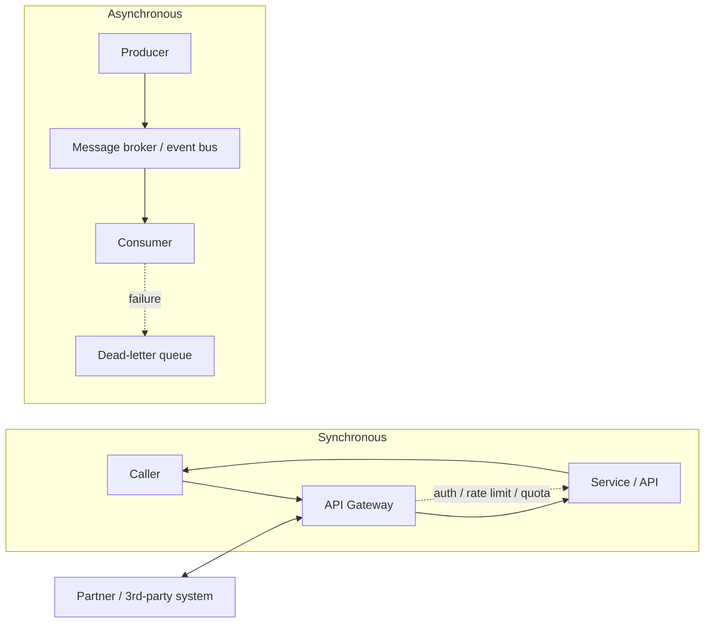

# Archetype: Integration / API Program

_Last reviewed: 2026-07-02 · Review cadence: quarterly_

Overseeing work that connects systems — internal services, partner/B2B integrations, EDI, event-driven pipelines, or exposing/consuming APIs.

> **TL;DR**
>
> - The core decision is **sync vs. async**: request/response when the caller needs an answer now, messaging/events when you need decoupling, buffering, and resilience.
> - The TPM's job: confirm there are **contracts** (versioned API specs / event schemas), that failures are handled with **retries + idempotency + dead-letter queues**, and that you're not depending on a **third party's SLA** without a fallback.
> - Biggest red flags: no versioned contract, **non-idempotent** retries that double-charge or duplicate, no dead-letter handling, and tight coupling to a partner system you don't control.

---

## What it is

Plumbing between systems. The value is in the *seams* — and seams are where data gets lost, duplicated, or silently dropped. The hard problems are failure handling, ordering, idempotency, and change management across a boundary you may not own.

---

## Scale note

> A **few point-to-point** integrations can be simple synchronous APIs. As the number of connections and the throughput grow, favor async/event-driven, a gateway for cross-cutting concerns, and contract governance — otherwise you get a brittle web of tightly-coupled calls. High-throughput continuous streams belong in [event-driven](event-driven-streaming.md).

---

## Reference architecture

---

## Sync vs. async — the defining choice

| | Synchronous (request/response) | Asynchronous (messaging/events) |
|---|---|---|
| **Use when** | Caller needs an immediate answer | Decoupling, buffering spikes, resilience, fan-out |
| **Pros** | Simple, immediate result | Resilient to outages, absorbs load, loosely coupled |
| **Cons** | Caller blocked; failures propagate; tight coupling | Eventual consistency; ordering/duplication to manage |
| **Failure mode** | Timeout, cascading failures | Stuck/duplicate messages, poison messages |
| **Needs** | Timeouts, circuit breakers, retries with backoff | Idempotency, dead-letter queues, replay |

---

## Green flags

- A **versioned contract** for every integration — OpenAPI/AsyncAPI spec or schema registry — agreed with the other side.
- **Idempotency** built in: the same message/request processed twice doesn't double-charge, double-ship, or duplicate.
- **Retries with backoff** and a **dead-letter queue** for messages that keep failing — nothing silently vanishes.
- **Auth, rate limiting, and quotas** at the gateway.
- **Timeouts and circuit breakers** on synchronous calls so one slow dependency doesn't take everything down.
- **Versioning strategy** for the API — consumers aren't broken when it evolves.
- Monitoring of the **integration itself**: throughput, error rate, queue depth, age of oldest message.

## Red flags / anti-patterns

- **No contract** — "we'll match whatever they send" — so any change on either side breaks it.
- **Non-idempotent retries** — a retry after a timeout double-processes.
- **No dead-letter handling** — failed messages disappear or block the queue (poison message stalls everything).
- **Synchronous chains** with no timeouts — one slow partner cascades into a full outage.
- Hard dependency on a **third-party SLA** with no fallback or degraded mode.
- **Breaking API changes** shipped with no versioning — downstream consumers break overnight.
- No visibility — nobody knows a queue is backing up until customers complain.

---

## TPM question bank

- Is each integration **sync or async**, and is that the right choice for the use case?
- Is there a **versioned contract**? Who agreed to it, and how do changes get communicated?
- Are operations **idempotent**? What happens if the same message arrives twice?
- What happens to a message that **keeps failing** — is there a dead-letter queue and a process to handle it?
- On synchronous calls, are there **timeouts and circuit breakers**? What's the blast radius if the dependency is slow?
- What's our exposure to a **third-party's uptime**? Is there a fallback or degraded mode?
- How do we **version** the API without breaking consumers?
- How do we **monitor** queue depth, error rates, and message age?

---

## Key risks

| Risk | How it shows up in the plan |
|------|-----------------------------|
| Duplicate/lost data | No idempotency; no dead-letter handling |
| Cascading failure | Synchronous chains, no timeouts/circuit breakers |
| Contract drift | No versioned spec; informal agreement with the other side |
| Third-party fragility | Hard dependency on a partner SLA, no fallback |
| Breaking changes | No API versioning strategy |
| Invisible backlog | No monitoring of queues/throughput/errors |

---

## Launch / readiness checklist

- [ ] Versioned contract (OpenAPI/AsyncAPI/schema) agreed with both sides
- [ ] Sync vs. async chosen deliberately per integration
- [ ] Idempotency implemented and tested (duplicate delivery handled)
- [ ] Retries with backoff + dead-letter queue + a process to drain it
- [ ] Timeouts + circuit breakers on synchronous calls
- [ ] Auth, rate limiting, quotas at the gateway
- [ ] API versioning strategy in place
- [ ] Third-party dependencies have fallback / degraded mode
- [ ] Monitoring: throughput, error rate, queue depth, oldest-message age

> See also: [SaaS multi-tenant](saas-multitenant.md) · [Reliability & observability](../cross-cutting/reliability-and-observability.md) · [Security & compliance](../cross-cutting/security-and-compliance.md)

[← Back to index](../README.md)
