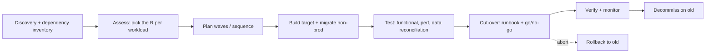

# Archetype: Migration / Modernization

_Last reviewed: 2026-07-02 · Review cadence: quarterly_

Overseeing the move of an existing system — to the cloud, between clouds, off a legacy platform, or a re-architecture in place.

> **TL;DR**
>
> - Every migration is one of the **"6 Rs"**: rehost, replatform, refactor, repurchase, retire, retain. Naming which one you're doing is the most important early decision — it sets cost, risk, and timeline.
> - The TPM's job: insist on a **discovery/dependency inventory** before any cut-over, a **data-migration + reconciliation** plan, a **rollback**, and a **cut-over runbook** with go/no-go criteria.
> - Biggest red flags: "lift and shift then optimize later" with no later, no inventory of what depends on the old system, big-bang cut-over with no rollback, and migrating data with no reconciliation.

---

## What it is

Moving or rebuilding a system that already exists and (usually) is in use. The defining constraint: **there's a running thing you can't break**, and a population of dependencies you may not fully know about.

---

## The 6 Rs — pick one (per workload)

| Strategy | What it means | When | Cost/risk |
|----------|---------------|------|-----------|
| **Rehost** ("lift & shift") | Move as-is to new infra | Speed matters; deadline-driven | Low effort, keeps old debt |
| **Replatform** | Minor optimizations during move (e.g. managed DB) | Some quick wins available | Moderate |
| **Refactor / re-architect** | Redesign for the new platform | Long-term value, scaling needs | High effort, highest payoff |
| **Repurchase** | Replace with SaaS | A commodity capability exists off the shelf | Switching cost, lock-in |
| **Retire** | Turn it off | Nobody actually uses it | Frees budget; verify first |
| **Retain** | Leave it where it is (for now) | Not worth moving yet | Defers the problem |

> A program usually mixes strategies across workloads. Make the choice **explicit per workload** — a single blanket "lift and shift everything" is a smell.

---

## Scale note

> For a **single application**, this is one wave with one cut-over. For a **portfolio** (dozens to hundreds of apps), it becomes a program: a discovery/assessment factory, wave planning, and per-workload "R" decisions at scale. The discipline is identical — the coordination and dependency management are what get hard.

---

## Reference flow

---

## Green flags

- A real **discovery phase**: an inventory of apps, data, integrations, and **who/what depends on the old system** (including the undocumented batch job nobody remembers).
- The **"R" is chosen per workload**, with rationale.
- Migration runs in **waves**, lowest-risk first, learning each time.
- A **data-migration plan** with **reconciliation** (counts, checksums, business-rule validation) — proof the new data matches the old.
- A **cut-over runbook** with timed steps, owners, **go/no-go gates**, and a **rollback**.
- The **old system stays warm** until the new one is proven, then is deliberately decommissioned.

## Red flags / anti-patterns

- "**Lift and shift, optimize later**" — the optimization never gets funded.
- **No dependency inventory** — surprises during cut-over because some system depended on the thing you moved.
- **Big-bang** cut-over with **no rollback**.
- Data migrated with **no reconciliation** — nobody can prove nothing was lost or mangled.
- The old system is **decommissioned too early**, before the new one is trusted.
- Feature parity assumed, never verified — the new system quietly does less.
- Timeline built with **no contingency** for the inevitable surprises.

---

## TPM question bank

- For each workload, **which "R"** are we doing, and why?
- Do we have a complete **dependency inventory**? What talks to the old system that we might not know about?
- What's the **data-migration** plan, and how do we **reconcile** that nothing was lost or changed?
- Is this **big-bang or phased**? If phased, what's the wave sequence and why?
- Show me the **cut-over runbook**. What are the **go/no-go** gates and the **rollback**?
- How long does the **old system stay running** in parallel, and what proves it's safe to decommission?
- How do we verify **feature parity** — that the new system does everything the old one did?
- What's the **contingency** in the timeline for things we'll discover?

---

## Key risks

| Risk | How it shows up in the plan |
|------|-----------------------------|
| Hidden dependencies | No discovery phase; "we'll find out at cut-over" |
| Data loss/corruption | No reconciliation step |
| No rollback | Big-bang cut-over, old system killed immediately |
| Parity gap | No parity verification; users find missing features in prod |
| "Optimize later" debt | Refactor work has no funded follow-up |
| Timeline optimism | Zero contingency for discovery surprises |

---

## Launch / cut-over checklist

- [ ] Dependency inventory complete; nothing unaccounted for
- [ ] "R" chosen and justified per workload
- [ ] Data migrated **and reconciled** (counts/checksums/business rules)
- [ ] Feature parity verified
- [ ] Performance tested on target at expected load
- [ ] Cut-over runbook with timed steps, owners, go/no-go gates
- [ ] Rollback tested
- [ ] Old system kept warm; decommission criteria defined
- [ ] Comms plan for affected users/teams; support coverage for the window

> See also: [AWS application](aws-application.md) · [Azure application](azure-application.md) · [Cloud service map](../reference/cloud-service-map.md) · [Operating model](../TPM-OPERATING-MODEL.md)

[← Back to index](../README.md)
