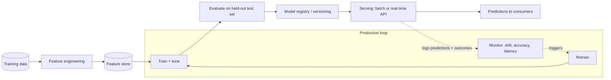

# Archetype: ML Model Project

_Last reviewed: 2026-07-02 · Review cadence: quarterly_

Overseeing a project that trains, evaluates, serves, and monitors a predictive model (classification, regression, ranking, forecasting, recommendations).

> **TL;DR**
>
> - The lifecycle is **data → features → train → evaluate → deploy → monitor**, and the part teams underinvest in is the **right end**: monitoring for drift and retraining.
> - The TPM's job: confirm the **evaluation is honest** (right metric, no leakage, a held-out test set), that the model is **reproducible**, and that there's a plan for **drift, retraining, and rollback** — a model decays after launch in a way that code doesn't.
> - Biggest red flags: a single accuracy number with no baseline, **data leakage** inflating offline scores, no monitoring after deploy, and no way to reproduce how the model was trained.

---

## What it is

A system that learns a function from data and makes predictions. Unlike normal software, **it degrades on its own** as the world drifts away from the training data — so "launch" is the beginning of the maintenance job, not the end.

---

## Scale note

> The lifecycle is the same at any size, but **serving** isn't. **Batch scoring** (periodic predictions written to a table) is simple and cheap. **Real-time, high-QPS serving** needs latency budgets, autoscaling, and a feature store to avoid train/serve skew. Retraining frequency scales with how fast your data drifts, not with model size.

---

## Reference architecture

---

## Components and what each does

| Stage | Role | What "good" looks like |
|-------|------|------------------------|
| **Feature engineering / store** | Build inputs the model learns from | Versioned; same features at train and serve time (no skew) |
| **Train + tune** | Fit the model | Reproducible — fixed seeds, tracked params, recorded data version |
| **Evaluate** | Measure real performance | Held-out test set; metric that matches the business goal; baseline to beat |
| **Model registry** | Version + stage models | Every prod model traceable to its data, code, and metrics |
| **Serving** | Make predictions available | Batch (scheduled scores) or real-time (API); latency budget defined |
| **Monitor** | Catch decay | Data drift, prediction drift, accuracy vs. ground truth, latency |
| **Retrain** | Refresh the model | Triggered on schedule or drift; goes through the same eval gate |

---

## Green flags

- A clear **baseline** the model has to beat (even "predict the average" or current rules).
- The **evaluation metric matches the business objective** (e.g. precision/recall trade-off chosen on purpose, not default accuracy).
- A **held-out test set** the model never saw; no **leakage** of future or target information into features.
- **Reproducible** training: tracked data version, code, params, environment (MLflow/W&B or equivalent).
- **Train/serve consistency** — the same feature logic in both, no skew.
- **Production monitoring** for drift and accuracy, with a **retraining trigger** and **rollback**.
- The team can state the model's **failure modes** and who's affected when it's wrong.

## Red flags / anti-patterns

- A single headline accuracy number, **no baseline**, no error analysis.
- **Data leakage** — features that wouldn't exist at prediction time inflate offline scores; reality disappoints.
- Test set contaminated by training data (**leaky cross-validation**).
- **Train/serve skew** — features computed differently in production than in training.
- **No monitoring** after deploy; nobody notices the model has decayed.
- Training can't be reproduced ("the person who made it left").
- Wrong metric for the cost structure (optimizing accuracy on imbalanced data where false negatives are expensive).

---

## TPM question bank

- What's the **baseline**, and by how much does the model beat it?
- Is the **evaluation metric** the right one for what the business cares about? What's the cost of a false positive vs. false negative?
- Is there a clean **held-out test set**? How do we know there's no **leakage**?
- Can we **reproduce** this model from scratch — data, code, params?
- Are training and serving features computed the **same way**?
- How will we know in production when the model is **decaying**? What triggers a **retrain**?
- What's the **rollback** if a new model performs worse in production?
- What are the model's known **failure modes**, and what's the human safety net?

---

## Key risks

| Risk | How it shows up in the plan |
|------|-----------------------------|
| Leakage / inflated metrics | Offline scores suspiciously high; no error analysis |
| Train/serve skew | Feature logic duplicated, not shared; no consistency check |
| Silent decay | No monitoring or retraining trigger after launch |
| Not reproducible | No experiment tracking / registry |
| Wrong objective | Metric chosen by default, not tied to business cost |
| Fairness / bias | No check on performance across segments (matters in regulated domains) |

---

## Launch / readiness checklist

- [ ] Baseline defined; model demonstrably beats it
- [ ] Evaluation metric tied to business objective and agreed
- [ ] Clean held-out test set; leakage checked
- [ ] Training reproducible; model versioned in a registry
- [ ] Train/serve feature consistency verified
- [ ] Serving latency within budget
- [ ] Production monitoring for drift + accuracy; retrain trigger defined
- [ ] Rollback to previous model tested
- [ ] Fairness/bias evaluated across relevant segments (esp. regulated use)
- [ ] Failure modes documented; human-in-the-loop where stakes are high

> See also: [Data engineering](data-engineering.md) feeds this · [GenAI / LLM](genai-llm.md) · [Reliability & observability](../cross-cutting/reliability-and-observability.md)

[← Back to index](../README.md)
