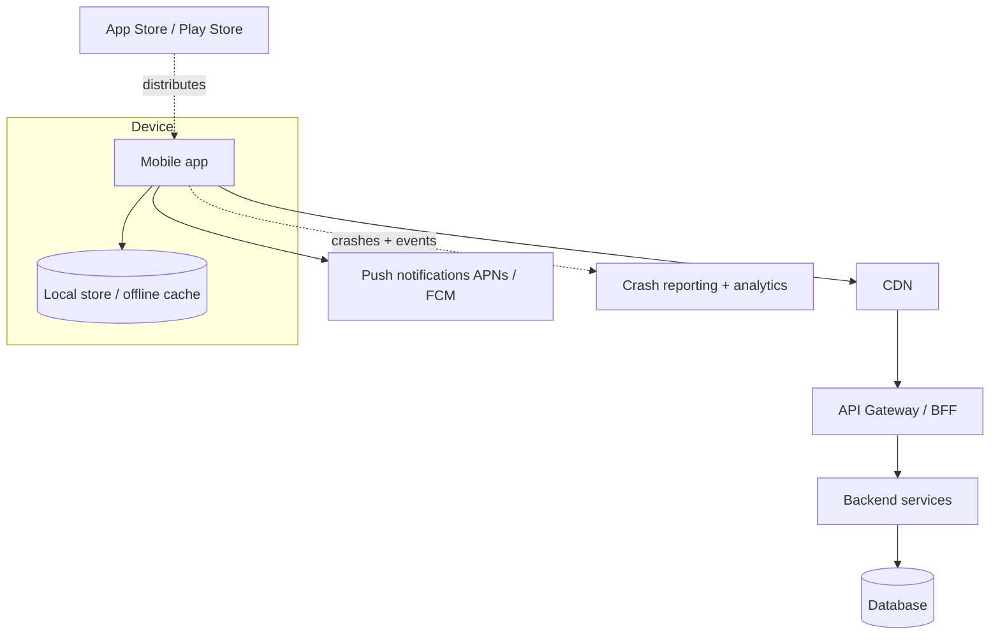

# Archetype: Mobile App

_Last reviewed: 2026-07-02 · Review cadence: quarterly_

Overseeing an iOS/Android app (native or cross-platform) plus its backend.

> **TL;DR**
>
> - The thing that makes mobile different from web: **you don't control the client**. Old versions live on users' phones for months, the network is flaky, and **app-store review** sits between you and a fix.
> - The TPM's job: insist on **backward-compatible APIs and forced-update capability**, an **offline/poor-network** story, **crash/analytics** instrumentation, and a realistic view of the **store release timeline**.
> - Biggest red flags: assuming everyone upgrades instantly, no offline handling, no crash reporting, secrets baked into the app binary, and forgetting store review can take days and can reject you.

---

## What it is

A client app distributed through app stores, talking to a backend. The backend looks like any [AWS](aws-application.md)/[Azure](azure-application.md) app; the **client and distribution** are what's special — and what trips up teams used to the web, where you ship a fix and everyone has it instantly.

---

## Scale note

> A **small user base** tolerates a simple backend and manual release checks. At **millions of installs**, version fragmentation, staged rollouts, crash-rate gating, and backend scale (per the [AWS](aws-application.md)/[Azure](azure-application.md) tiers) all become first-order — a bad release reaches a lot of phones fast, and you can't recall it.

---

## Reference architecture

---

## Components and what each does

| Component | Role | TPM note |
|-----------|------|----------|
| **Mobile client** | Native (Swift/Kotlin) or cross-platform (Flutter/React Native) | Cross-platform = faster shared dev, some native trade-offs |
| **Offline cache** | Local data so the app works on bad networks | Defines what's usable offline and how conflicts resolve |
| **BFF / API gateway** | Backend-for-frontend tailored to mobile needs | Keeps the client thin; must stay backward-compatible |
| **Push (APNs / FCM)** | Notifications | Permissions + deliverability matter |
| **Crash + analytics** | See what's happening on devices you don't control | Non-negotiable; it's your only window |
| **App stores** | Distribution + review gate | Review delay and rejection risk are real schedule factors |

---

## Green flags

- **Backward-compatible APIs** — the backend supports the app versions still in the wild, not just the latest.
- A **forced-update / kill-switch** mechanism for when an old version must be retired or a feature disabled remotely.
- A real **offline / poor-network** design — clear behavior when connectivity drops, sensible sync/conflict handling.
- **Crash reporting + analytics** (Crashlytics, Sentry, etc.) live from day one.
- **Secrets are not in the app binary** — anything shipped to a device can be extracted.
- **Phased / staged rollout** through the stores to catch problems before 100%.
- Store **review timeline** is built into the release plan, not discovered at the end.

## Red flags / anti-patterns

- Assuming **everyone is on the latest version** — they aren't, for months.
- **No offline handling** — the app is unusable on a subway or a weak signal.
- **No crash reporting** — you're blind to what's failing on real devices.
- **API keys / secrets hardcoded** in the client binary.
- **Breaking API change** shipped without supporting older app versions → those users break.
- No **staged rollout** — a bad build hits everyone at once.
- Store **review** treated as a formality (it can take days and can reject).

---

## TPM question bank

- How do we support users on **older app versions**? How long must the backend stay compatible?
- Do we have a **forced-update / remote kill-switch** if a version must be pulled?
- What's the **offline** behavior? What happens on a bad network, and how do conflicts resolve when sync returns?
- Is **crash reporting + analytics** in place? Show me the dashboard.
- Are there any **secrets in the app binary**? (There shouldn't be.)
- Are we doing a **staged rollout**? What's the abort plan if crash rates spike?
- What's the **app-store review** lead time, and is it in the release plan?
- Native or cross-platform — and was that trade-off deliberate?

---

## Key risks

| Risk | How it shows up in the plan |
|------|-----------------------------|
| Version fragmentation | Backend assumes latest client; no compatibility window |
| No remote control | No forced-update / kill-switch when a version misbehaves |
| Blind to failures | No crash reporting/analytics |
| Secrets exposed | Keys hardcoded in the binary |
| Store delay/rejection | Review not in the timeline; no buffer |
| Bad-network UX | No offline story; assumes always-connected |

---

## Launch / readiness checklist

- [ ] Backward-compatibility window for older app versions defined and supported
- [ ] Forced-update / remote kill-switch available
- [ ] Offline / poor-network behavior designed and tested
- [ ] Crash reporting + analytics live
- [ ] No secrets in the client binary; sensitive logic server-side
- [ ] Staged/phased rollout configured with an abort threshold
- [ ] App-store review lead time built into the schedule
- [ ] Push notifications + permissions tested
- [ ] Backend readiness per the [AWS](aws-application.md)/[Azure](azure-application.md) checklist

> See also: [Integration / API](integration-api.md) · [Security & compliance](../cross-cutting/security-and-compliance.md) · [Reliability & observability](../cross-cutting/reliability-and-observability.md)

[← Back to index](../README.md)
