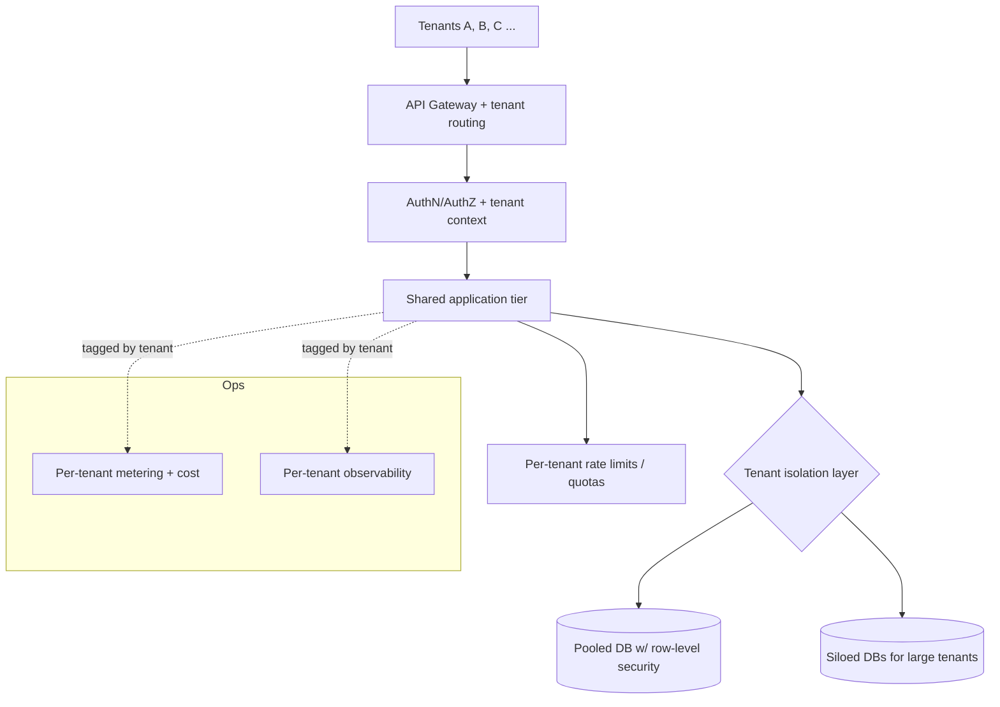

# Archetype: SaaS Multi-Tenant

_Last reviewed: 2026-07-02 · Review cadence: quarterly_

Overseeing a product that serves many customer organizations (tenants) from shared infrastructure.

> **TL;DR**
>
> - The defining question is **tenant isolation**: how do you guarantee Customer A can never see Customer B's data? This drives the whole architecture.
> - The TPM's job: confirm the **tenancy model** is explicit and isolation is enforced and tested, that you can **onboard/offboard** a tenant cleanly, that you have **per-tenant observability and cost attribution**, and that one tenant can't degrade everyone (**noisy neighbor**).
> - Biggest red flags: isolation enforced only in application code with no defense in depth, no per-tenant limits, no way to export/delete one tenant's data, and a single bad tenant able to take down the platform.

---

## What it is

One codebase and (mostly) shared infrastructure serving many customers. The hard parts aren't features — they're **isolation, fairness, per-tenant operations, and the blast radius of a shared platform** where one bug or one heavy customer can affect everyone.

---

## Tenancy models — the foundational choice

| Model | Isolation | Cost/ops | Use when |
|-------|-----------|----------|----------|
| **Pooled** (shared DB, tenant ID column) | Logical only — relies on every query filtering correctly | Cheapest, simplest to operate | Many small tenants, lower isolation needs |
| **Bridge** (shared DB, schema/row-level security per tenant) | Stronger logical isolation | Moderate | Middle ground |
| **Siloed** (DB/stack per tenant) | Strongest — physical separation | Most expensive, most ops | Regulated, enterprise, or high-isolation customers |

> Many mature products are **hybrid**: pooled for the long tail, siloed for large/regulated tenants. The point is to **choose deliberately** and know how isolation is *enforced*, not assumed.

---

## Scale note

> Tenant count drives the model. **A few / early tenants:** pooled (shared DB, tenant-ID) is usually fine. **Many tenants:** invest in isolation depth, per-tenant limits, automated onboarding, and cost attribution. **Large / regulated tenants:** go hybrid or siloed for the ones that demand physical isolation. See the tenancy-model table above.

---

## Reference architecture

---

## Green flags

- The **tenancy model is explicit**, and isolation is **enforced in depth** — not just an app-layer `WHERE tenant_id =` that one forgotten query can bypass. Database **row-level security** or equivalent backs it up. (RLS is a strong backstop, not a free one — it adds query-planning overhead and complexity, so it's a deliberate trade-off, not a silver bullet. The point is *defense in depth*, whatever the mechanism.)
- **Isolation is tested** — there's an automated test that proves Tenant A can't read Tenant B.
- **Per-tenant rate limits / quotas** prevent a **noisy neighbor** from starving everyone else.
- Clean **onboarding and offboarding** — provisioning a tenant and **exporting/deleting** one tenant's data are designed operations (matters for contracts and privacy law).
- **Per-tenant observability and cost attribution** — you can answer "is Tenant X having a bad time?" and "what does Tenant X cost us?"
- A plan for **per-tenant configuration / customization** that doesn't fork the codebase.
- Blast-radius thinking: one tenant's bad data or load **can't take down the platform**.

## Red flags / anti-patterns

- Isolation lives **only in application code** — one missing filter leaks data across tenants. (This is the classic catastrophic SaaS bug.)
- **No per-tenant limits** — one customer's runaway usage degrades everyone (noisy neighbor).
- **No tenant export/delete** — can't satisfy a churned customer's data-deletion request or a GDPR/DPDP erasure.
- **No per-tenant visibility** — when one customer complains, you can't isolate their experience.
- Customization done by **forking** or by piling tenant-specific branches into the code.
- Onboarding a tenant is a **manual, error-prone** ritual.
- No cost attribution — you can't tell which tenants are unprofitable.

---

## TPM question bank

- What's the **tenancy model**, and **how is isolation enforced** — app layer only, or defense in depth (RLS, separate schemas/DBs)?
- Is there an **automated test** proving one tenant can't access another's data?
- What stops a **noisy neighbor** — are there per-tenant rate limits and quotas?
- How do we **onboard** a new tenant? Is it automated?
- Can we **export and delete** a single tenant's data on request? (Contractual and legal need.)
- Do we have **per-tenant observability** and **cost attribution**?
- How is **per-tenant customization** handled without forking the codebase?
- What's the **blast radius** if one tenant sends garbage or huge load?

---

## Key risks

| Risk | How it shows up in the plan |
|------|-----------------------------|
| Cross-tenant data leak | Isolation only in app code; no RLS; no isolation test |
| Noisy neighbor | No per-tenant quotas/limits |
| Can't offboard | No export/delete-per-tenant capability |
| No tenant visibility | Observability/cost not tagged by tenant |
| Codebase fork | Tenant customization via branches/forks |
| Manual onboarding | Provisioning is a hand process; doesn't scale |

---

## Launch / readiness checklist

- [ ] Tenancy model chosen and documented
- [ ] Isolation enforced in depth (not app-layer only) and **tested automatically**
- [ ] Per-tenant rate limits / quotas in place
- [ ] Automated tenant onboarding
- [ ] Per-tenant data export + deletion supported
- [ ] Per-tenant observability + cost attribution
- [ ] Per-tenant configuration without code forks
- [ ] Blast-radius limits so one tenant can't take down the platform
- [ ] Compliance per [security & compliance](../cross-cutting/security-and-compliance.md) (SOC 2 is table stakes for B2B SaaS)

> See also: [AWS application](aws-application.md) · [Azure application](azure-application.md) · [Integration / API](integration-api.md) · [FinOps & cost](../cross-cutting/finops-cost.md)

[← Back to index](../README.md)
