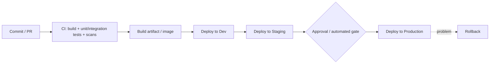

# Cross-Cutting: CI/CD & Environments

_Last reviewed: 2026-07-02 · Review cadence: quarterly_

How code gets from a developer's laptop to production safely and repeatedly. A healthy pipeline is one of the strongest signals of a healthy project — and a manual, scary deploy is one of the strongest warning signs.

> **TL;DR**
>
> - **CI** = every change is automatically built and tested. **CD** = changes flow to environments through an automated, repeatable pipeline.
> - The questions that reveal the truth: *how long from commit to production, how do we roll back, and how often does a deploy go wrong?*
> - The TPM's job: confirm there are **separate environments**, **infrastructure as code**, a **tested rollback**, and that **deploys are boring** — frequent, automated, low-drama.

---

## The pipeline

**CI (Continuous Integration):** every commit/PR triggers an automated build, the test suite, and security/dependency scans. Broken changes are caught before merge.

**CD (Continuous Delivery/Deployment):** the validated artifact moves through environments automatically. *Delivery* = automated up to a manual prod approval; *Deployment* = all the way to prod automatically when checks pass.

---

## Environments

| Environment | Purpose | Should be |
|-------------|---------|-----------|
| **Dev** | Active development, fast iteration | Cheap, frequently reset |
| **Staging / Pre-prod** | Realistic rehearsal before prod | **As close to prod as possible** — same config, representative data |
| **Production** | The real thing | Guarded; changes only via the pipeline |

> The most useful staging environment is the one that's **genuinely like production**. A staging box that differs from prod gives false confidence — bugs hide in the differences.

**Config & secrets:** the same artifact promoted across environments, with config/secrets injected per environment (from a vault, never baked into the build). Building separately per environment is a smell.

---

## Release & rollback strategies

| Strategy | How | Why a TPM cares |
|----------|-----|-----------------|
| **Blue/green** | Two identical envs; switch traffic to the new one | Instant rollback — switch back |
| **Canary** | Release to a small % first, watch, then widen | Limits blast radius of a bad release |
| **Rolling** | Replace instances gradually | No downtime; slower to fully roll back |
| **Feature flags** | Ship code dark, turn features on/off at runtime | Decouple deploy from release; kill a feature without redeploying |

The strategy matters less than the principle: **a bad release must be reversible quickly, and that reversal must have been tested.**

---

## Signals of a healthy vs. unhealthy pipeline

**Healthy**
- Commit-to-prod is **short** (hours, not weeks) and deploys are **frequent**.
- Deploys are **automated** and **boring** — nobody dreads them.
- **Rollback is one action** and has been tested.
- **IaC** means environments are reproducible and consistent.
- Tests + scans **gate** the pipeline; you can't ship past a red build.

**Unhealthy**
- **Manual deploys** with a runbook of hand-steps; "only Priya can deploy."
- Deploys are **rare and scary**, scheduled for weekends.
- **No rollback**, or rollback is "redeploy the old version and pray."
- Environments **drift** — staging and prod differ in undocumented ways.
- Tests are flaky/ignored; people merge past red.

---

## TPM question bank (CI/CD & environments)

- How long from **commit to production**? How often do we deploy?
- Is the pipeline **automated end to end**, or are there manual steps?
- How do we **roll back** a bad release, and when did we last test it?
- Do we have **separate environments**, and is **staging genuinely like prod**?
- Is infrastructure **defined as code**? Can we recreate an environment from scratch?
- Are **tests and security scans gating** the pipeline, or advisory?
- How are **secrets and config** handled across environments?
- What's our **release strategy** (canary/blue-green/flags), and what's the blast radius of a bad deploy?

[← Back to index](../README.md)
